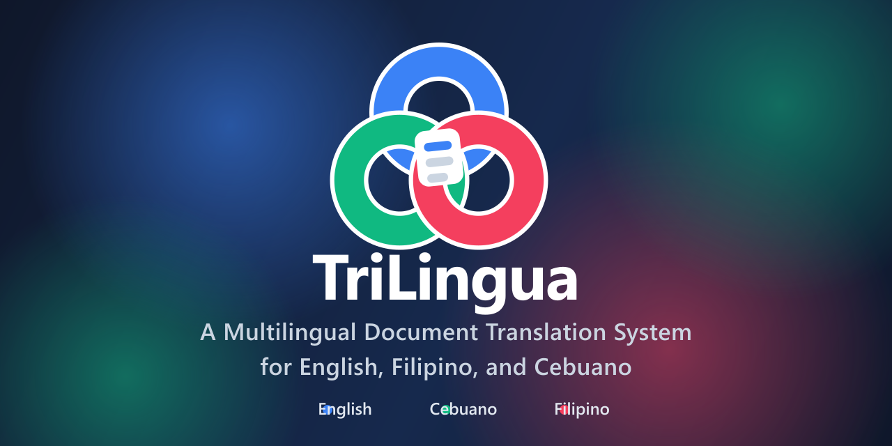

# TriLingua - 3-Way Translation System



> **Capstone Project** - A multilingual document translation system for English, Filipino, and Cebuano languages

[](https://laravel.com)
[](https://python.org)
[](LICENSE)

## 📖 About This Project

**TriLingua** is a capstone project for translation between **Cebuano**, **Filipino (Tagalog)**, and **English**. Laravel handles accounts, history, storage and review; a Python/FastAPI service handles translation and document reconstruction. The current default uses GPT-OSS through Ollama Cloud with Gemini fallback and quality review. Translation quality still requires bilingual human validation.

For production, follow the [Laravel Cloud deployment guide](docs/LARAVEL_CLOUD_DEPLOYMENT.md). Deploy both applications from `main`; application roots are `trilingua-code` and `trilingua-code/Model`. The $5 Starter subscription is usage-based, and the current database queue needs an awake worker.

### 🎯 Project Goals

- Preserve and promote Philippine languages through accessible translation technology
- Provide accurate document-level translation for educational and professional use
- Bridge communication gaps between different language communities in the Philippines
- Demonstrate practical application of modern AI/ML models in language processing

## ✨ Features

- **🔄 3-Way Translation**: Translate between Cebuano, Filipino, and English in any direction
- **📄 Document Support**: Upload and translate DOCX, PDF, TXT, MD, CSV, RTF, ODT, PPTX, and XLSX files
- **💬 Text Translation**: Quick translation for short texts and phrases
- **📊 Translation History**: Track and manage all your translations
- **🎨 Modern UI**: Clean, responsive interface with dark/light theme support
- **🔐 User Authentication**: Secure account system with password reset
- **📈 Dashboard Analytics**: View translation statistics and activity

## 🛠️ Technology Stack

### Frontend
- **Laravel Blade** - Server-side templating
- **Vite** - Modern build tool
- **Tailwind CSS** - Utility-first CSS framework
- **Vanilla JavaScript** - No framework overhead

### Backend
- **Laravel 12** - PHP web framework
- **PHP 8.2+** - Server-side language
- **SQLite** - Local database
- **Supabase** - PostgreSQL and private document storage in the hosted configuration

### AI/ML
- **Python 3.11** - Translation runtime
- **FastAPI** - Translation API server
- **GPT-OSS / Gemini** - Cloud translation and analysis providers
- **NLLB-200** - Optional local provider, outside the small hosted configuration
- **Transformers** - Only required by the optional local NLLB provider

## 📋 Prerequisites

Before installation, ensure you have:

- **PHP 8.2+** with extensions: `fileinfo`, `zip`, `pdo_sqlite`, `sqlite3`
- **Composer** - PHP dependency manager
- **Node.js 22+** & npm - JavaScript runtime and package manager
- **Python 3.11** & pip - Python runtime and package manager
- **Git** - Version control

## 🚀 Installation

### 1. Clone the Repository

```bash
git clone https://github.com/walbengwapo-png/Trilingua.git
cd Trilingua/trilingua-code
```

### 2. Install PHP Dependencies

```bash
composer install
```

### 3. Install Node.js Dependencies

```bash
npm ci
```

### 4. Install Python Dependencies

```bash
pip install -r Model/requirements.txt
```

### 5. Configure AI Providers

Set the Ollama Cloud and Gemini settings from `.env.example`. Cloud providers do not require a local model download. The optional NLLB provider requires its own dependencies and model files.

### 6. Configure Environment

```bash
cp .env.example .env
php artisan key:generate
```

Edit `.env` and update:
- `APP_NAME=TriLingua`
- `APP_URL=http://localhost:8000`
- Supabase database and private storage credentials for document workflows

### 7. Set Up Database

```bash
php artisan migrate
```

### 8. Build Frontend Assets

```bash
npm run build
```

## 🎮 Running the Application

You need to run **two servers** simultaneously:

### Terminal 1: Python Translation Server

```bash
python Model/server.py
```

This starts the ML translation service on `http://127.0.0.1:5000`

### Terminal 2: Laravel Web Server

```bash
php artisan serve
```

This starts the web application on `http://127.0.0.1:8000`

### Access the Application

Open your browser and navigate to: **http://localhost:8000**

## 📚 Documentation

- [Installation Guide](trilingua-code/README.md)
- [Password Reset Guide](trilingua-code/PASSWORD_RESET_GUIDE.md)
- [Dashboard Fix](trilingua-code/DASHBOARD_FIX.md)
- [Authentication Testing](trilingua-code/AUTHENTICATION_TESTING.md)

## 🧪 Testing

### Create a Test User

```bash
php artisan tinker
```

```php
User::create([
    'name' => 'Test User',
    'email' => 'test@example.com',
    'password' => bcrypt('password123')
]);
```

### Run Tests

```bash
php artisan test
```

## 🌐 Supported Languages

| Language | Code | Direction |
|----------|------|-----------|
| English | `eng_Latn` | ↔️ Cebuano, Filipino |
| Cebuano | `ceb_Latn` | ↔️ English, Filipino |
| Filipino | `fil_Latn` | ↔️ English, Cebuano |

## 📁 Project Structure

```
Trilingua/
├── trilingua-code/          # Main application
│   ├── app/                 # Laravel application code
│   │   ├── Http/           # Controllers, Middleware
│   │   ├── Models/         # Eloquent models
│   │   └── Services/       # Business logic
│   ├── Model/              # Python ML server
│   │   ├── server.py       # FastAPI translation server
│   │   └── document_translator_v3.py
│   ├── resources/          # Frontend assets
│   │   ├── views/          # Blade templates
│   │   ├── css/            # Stylesheets
│   │   └── js/             # JavaScript
│   ├── routes/             # Web routes
│   ├── database/           # Migrations, seeders
│   └── public/             # Public assets
└── README.md               # This file
```

## 🤝 Contributing

This is a capstone project, but contributions, issues, and feature requests are welcome!

1. Fork the repository
2. Create your feature branch (`git checkout -b feature/AmazingFeature`)
3. Commit your changes (`git commit -m 'Add some AmazingFeature'`)
4. Push to the branch (`git push origin feature/AmazingFeature`)
5. Open a Pull Request


## 👥 Authors

- **KenUsa-31** - [GitHub Profile](https://github.com/KenUsa-31)

## 🙏 Acknowledgments

- **Facebook AI Research** - For the NLLB-200 translation model
- **Laravel Community** - For the excellent PHP framework
- **Hugging Face** - For the Transformers library
- **University/Institution** - For supporting this capstone project

## 📧 Contact

For questions or feedback about this capstone project, please open an issue on GitHub.

---


