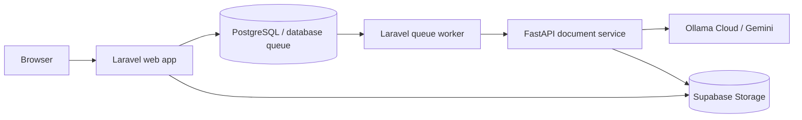

# TriLingua deployment strategy report

**Prepared:** September 13, 2026  
**Decision scope:** Low-cost public deployment without making document translation slower or less reliable than the current local setup.

## Executive decision

**Railway Hobby is a reasonable managed-web-hosting choice, but not a “minimal-to-no-cost, same-as-local-performance” solution for the whole application.** Use it only if a predictable **minimum of US$5/month** is acceptable and the application is changed to call an externally reachable LLM API. It has no GPU service in this plan, and running the current three long-lived services continuously can exceed the included credit.

**Recommended primary deployment:** use **Railway Hobby** now, with separate web, worker, and Python translator services, while keeping Supabase and the cloud AI providers external. It removes this personal PC from the serving path, resolves the present single-process web-server bottleneck, and needs no GPU because translation inference stays in Ollama Cloud/Gemini. Budget a US$5 monthly minimum and validate direct Ollama Cloud authentication before release.

> **Clarification added after validating the current launch path:** A full Railway deployment is technically viable with Ollama Cloud, Supabase, and the Python service all in Railway. It does not need a GPU because inference remains in Ollama Cloud. The current `localhost:11434` setup, however, is a local Ollama client acting as the cloud-model gateway; a Railway container needs direct Ollama Cloud API configuration and an API-key authorization header instead. This is a small, necessary deployment change—not a reason to reject Railway.

The final choice should be based on the availability requirement:

| Need | Best fit |
|---|---|
| Public capstone demo, controlled pilot, or small invited user group; PC can stay on | Local PC + named Cloudflare Tunnel |
| Always-on public web app; operator does not want to maintain a PC | **Railway Hobby + Supabase + direct Ollama Cloud/Gemini API** |
| Railway cannot meet the US$5 budget or direct API test | **Oracle Cloud Always Free ARM VM + Docker + Supabase** |
| High traffic, strict uptime, or fully local/private model inference | Neither low-cost option; budget for a GPU host or a more capable on-premise machine |

## What the codebase actually requires

TriLingua is not a simple Laravel site. The deployed runtime has these parts:

- Laravel 12 provides authentication, the UI, history, uploads, reviews, and job status.
- Document work is asynchronous: `TranslateDocumentJob` runs through the **database queue** and calls a FastAPI service. One HTTP web process alone is insufficient.
- The Python service parses and reconstructs PDF, DOCX, PPTX, XLSX, and text formats. It uses external AI providers for translation/analysis.
- The current environment defaults to `gpt-oss:20b-cloud` through an Ollama service at `http://localhost:11434`, with Gemini as fallback/analysis. The README’s older NLLB-200 description is not the active translation architecture.
- Results and originals are designed to live in Supabase Storage, rather than a transient worker disk. The UI allows up to 50 MB per upload and the default per-user daily limit is 250 MB.

This PC has an Intel i5-14400, 16 GB RAM, and Intel integrated graphics. It is appropriate for the Laravel/FastAPI/document-processing workload. It is **not** an appropriate host for a performant local `gpt-oss:20b` model: there is no discrete GPU/VRAM. The existing configuration consequently uses cloud inference.

### Actual performance constraint

The checked-in local benchmark report shows the current external providers, not PHP or Python CPU, dominate latency:

- GPT-OSS live calls averaged about **8.9 seconds** at one request, about **16.2 seconds** at two concurrent requests, and became much slower at higher concurrency.
- Gemini live calls averaged about **1.7 seconds** at one request and **1.9 seconds** at two; the tested four- and eight-request runs produced rate-limit failures.

Therefore, moving the app from this PC to Railway will not materially make translations faster. Over-parallelising them can make them less reliable. Start production with **one document queue worker**, `TRANSLATION_MAX_CONCURRENT=1–2`, and provider concurrency capped at the empirically stable level; then load-test before raising it.

## Assessment: Railway Hobby

### Strengths

- Railway provides an always-on public endpoint, HTTPS/domain support, deployment from GitHub/Docker, health checks, restart policies, private service networking, and a 99.9% availability target on Hobby. Its Laravel guide explicitly supports separate app, queue-worker, and scheduled-task services. [Railway pricing](https://railway.com/pricing), [Laravel deployment guide](https://docs.railway.com/guides/laravel)
- Hobby includes US$5 of usage each month and allows enough resource headroom for this non-GPU stack. Railway charges by actual RAM, CPU, volume storage, and egress use, rather than by the configured ceiling. [Railway plan and usage details](https://docs.railway.com/pricing/plans)
- Supabase can remain the shared PostgreSQL/storage provider. The free tier currently includes 500 MB database, 1 GB file storage, and 5 GB egress—adequate for a short pilot, but not for large document retention. [Supabase pricing](https://supabase.com/pricing)

### Why it is not a complete fit yet

1. **It is not free.** Hobby is a US$5 monthly minimum, even when use remains within its included usage. Its current metering is US$10/GB-month of RAM, US$20/vCPU-month, US$0.15/GB-month volume storage, and US$0.05/GB egress. [Railway pricing details](https://docs.railway.com/pricing)
2. **There is no GPU assumption to rely on.** Railway is a good place for the web, worker, and Python document service, but it will not reproduce a local GPU model setup. In this project this matters less because inference is already cloud-based.
3. **The current Ollama endpoint breaks after a move.** `http://localhost:11434` would mean “inside the Railway container,” not this computer. The Python provider currently sends only `Content-Type`; Ollama’s direct cloud API requires a bearer API key. Before a full Railway deployment, either:
   - change the provider to use `https://ollama.com/api/chat` plus `Authorization: Bearer $OLLAMA_API_KEY`, and verify the direct-cloud model name from `/api/tags`; or
   - use Gemini as the translation provider, which already has remote API authentication in the code; or
   - keep the Python service local and expose only a protected private route—an unnecessary and fragile split.

   Ollama documents both local cloud-model access and direct API access through `ollama.com` with an API key. [Ollama Cloud documentation](https://docs.ollama.com/cloud)
4. **Three persistent services consume budget.** A web app, queue worker, and FastAPI service should be separate so a document job cannot block login/page requests. That is operationally correct, but their combined idle RAM plus CPU polling can push actual resource use past the US$5 credit. An illustrative 24/7 footprint of 0.4–0.8 GB combined resident RAM and 0.03–0.10 average vCPU is roughly **US$4.60–US$10.00/month before egress and storage**. This is a planning range, not a quote; measure Railway metrics in the first billing cycle.
5. **Provider cost and limits remain.** Railway does not include Gemini/Ollama usage. Free AI tiers may be suitable for a capstone demo but should not be presented as a production SLA. Rate limits are already visible in the project’s live benchmark results.

### Correction: the earlier Cloudflare “one-user” observation

The restriction was **not caused by Cloudflare Tunnel**. A named tunnel has four outbound connections by default, and Cloudflare permits additional replicas for availability; the 200-in-flight-request limit is documented only for temporary Quick Tunnels. [Cloudflare Tunnel configuration](https://developers.cloudflare.com/tunnel/configuration/), [Quick Tunnel limit](https://developers.cloudflare.com/tunnel/setup/)

The local launch scripts expose Laravel through `php artisan serve`. That runs PHP’s built-in development server. PHP documents it as one single-threaded process, says that a blocked request stalls the application, and explicitly says its multi-worker test mode is unsupported on Windows. The repository scripts intentionally start exactly this single worker.

There are two code/runtime limits that explain the observed behaviour:

| Layer | Current limit | User-visible effect |
|---|---:|---|
| Laravel HTTP origin | One Windows PHP development-server process | Concurrent page loads, uploads, status polling, or slow requests queue behind each other |
| FastAPI translation service | `TRANSLATION_MAX_CONCURRENT=2`; then a 30-second wait | Two active translation pipelines total; a third waits and then can receive HTTP 503 |
| Laravel database queue | Two workers in `start-demo.ps1` by default | At most two document jobs are fetched at once; the FastAPI cap is still the final translation limit |

The first is a server-launch problem, not an account/session problem. The second is intentional provider protection, not a Cloudflare limitation. Multiple people can sign in and use the app, but they cannot all execute translations at once under those caps. [PHP built-in web-server documentation](https://www.php.net/commandline.webserver)

**How to validate it cleanly:** use three separate browser profiles/accounts. While account A uploads a sizeable document, load a normal page and submit text translation from accounts B and C. Check: (1) PHP/Laravel request timing, (2) FastAPI responses for `Server busy`/503, and (3) queue depth. If the tunnel is healthy, Cloudflare is not the bottleneck; its tunnel-health page also notes that a healthy tunnel does not prove the internal origin is healthy. [Cloudflare monitoring](https://developers.cloudflare.com/tunnel/monitoring/)

### Railway architecture if chosen

Deploy three services from the same repository, all in one Railway project:

| Service | Public? | Start responsibility |
|---|---:|---|
| `web` | Yes | Laravel HTTP server, built Vite assets |
| `worker` | No | `php artisan queue:work --tries=3 --timeout=900 --sleep=1` |
| `translator` | No | Uvicorn/FastAPI on port 5000 |

Set `PYTHON_SERVICE_URL` on both `web` and `worker` to the translator’s private Railway hostname, for example `http://translator.railway.internal:5000`. Railway’s private network is intended for exactly this service-to-service traffic. [Railway private networking](https://docs.railway.com/guides/docker-compose)

For the translator service, configure direct cloud inference rather than `localhost`:

| Variable / code concern | Railway-safe intent |
|---|---|
| `OLLAMA_CLOUD_URL` | `https://ollama.com/api/chat` |
| `OLLAMA_API_KEY` | Railway secret, never committed |
| GPT-OSS request headers | Send `Authorization: Bearer <OLLAMA_API_KEY>` when calling the direct API |
| model name | Query Ollama’s direct `/api/tags` endpoint and use the listed direct-cloud name; do not assume the local `-cloud` suffix is identical |
| `PYTHON_SERVICE_URL` | Railway private FastAPI URL, not a public URL |

Ollama’s official Cloud documentation specifically supports direct `ollama.com` API access with a bearer key. The present provider implementation has the correct chat payload but only supplies `Content-Type`; it needs the authorization addition for this topology. [Ollama Cloud documentation](https://docs.ollama.com/cloud)

Use Supabase PostgreSQL for the shared database, Supabase Storage for files, and database-backed sessions/cache/queue for the pilot. Do **not** use SQLite, file sessions, file cache, or local output storage across the separated cloud services; their filesystems are not shared or durable. A later Redis upgrade can reduce database queue polling, but it is not necessary for the first low-volume release.

### Railway go/no-go checklist

- [ ] Add a production Dockerfile or Railway build/start configuration for PHP + built Vite assets, and a separate Python image/service.
- [ ] Make the LLM provider externally reachable and authenticated; test a real text translation from Railway before inviting users.
- [ ] Set `APP_ENV=production`, `APP_DEBUG=false`, a unique `APP_KEY`, HTTPS-only secure cookies, a strong `PYTHON_SERVICE_TOKEN`, and production `APP_URL`/Google OAuth callback.
- [ ] Use Supabase PostgreSQL and Supabase Storage; run all migrations once from a controlled release process.
- [ ] Run exactly one worker initially and cap provider concurrency at 1–2.
- [ ] Set a strict Railway spending alert/limit and watch RAM, CPU, egress, queue depth, and provider failures for one month.
- [ ] Establish retention/deletion rules. At 50 MB per file, Supabase’s 1 GB free storage could be consumed by roughly 20 maximum-size files before accounting for original+translated copies.

## Alternative: no-PC, near-zero-cost VM deployment

If Railway fails the direct-provider test, cannot stay within the budget, or its deployment experience does not suit the project, use an **Oracle Cloud Always Free ARM VM**. The current Always Free allocation is up to **2 OCPUs and 12 GB RAM total**, plus 200 GB block storage in the home region; this comfortably fits a low-volume Laravel/Python/queue stack that delegates inference to cloud AI. [Oracle Always Free resources](https://docs.oracle.com/en-us/iaas/Content/FreeTier/freetier_topic-Always_Free_Resources.htm)

Run Docker Compose on one Ubuntu ARM VM:

- Caddy or Nginx + PHP-FPM Laravel web container (public); 
- Laravel queue-worker container (private); 
- FastAPI/Uvicorn container (private); 
- Supabase remains the managed database and document store; 
- Ollama Cloud and Gemini are reached with API keys from the FastAPI container.

This is a valid free fallback that does **not** use this PC. It involves more Linux/Docker/server administration than Railway, ARM-compatible images must be tested, and Always Free VM capacity can be unavailable in a home region. Oracle may also reclaim an instance that it classifies as idle for seven days, so automated backups and a redeploy runbook are mandatory. It is suitable for a capstone or pilot, not a contractual-uptime production service.

## Local-first public deployment (available, but not recommended for this decision)

### Architecture

Run the current components on this PC:

- Laravel web app, Laravel queue worker, FastAPI service, and the local Ollama client;
- Supabase PostgreSQL and Storage for durable cross-device data;
- a **named Cloudflare Tunnel** that exposes only the Laravel HTTP port at `https://app.yourdomain.tld`.

Cloudflare Tunnel makes outbound encrypted connections from this computer; it needs no open inbound firewall ports or public IP. Named tunnels use a stable hostname, unlike temporary `trycloudflare.com` URLs. Cloudflare recommends named tunnels for production traffic and OAuth callbacks. [Cloudflare Tunnel overview](https://developers.cloudflare.com/tunnel/), [setup guide](https://developers.cloudflare.com/tunnel/setup/)

The repository already has `deploy-named-tunnel.ps1`, `undeploy-named-tunnel.ps1`, and `start-demo.ps1`. The named-tunnel script already handles the stable `APP_URL`, secure cookie settings, and Google redirect URI. It is much closer to a viable deployment than the quick tunnel path, which is explicitly for short-lived demos and has no uptime guarantee. [Cloudflare’s Quick Tunnel limitations](https://developers.cloudflare.com/cloudflare-one/networks/connectors/cloudflare-tunnel/do-more-with-tunnels/trycloudflare/)

### Why this is the best low-cost/performance option

- The processor, memory, installed services, provider settings, and document pipeline are identical to local use—so document execution performance is the same.
- Translation still relies on the same cloud model services, so it does not impose an impossible local 20B-model workload on this integrated GPU.
- There is no Railway compute charge. A Cloudflare account/tunnel is available on all Cloudflare plans; the only likely additional cost is a domain if one is not already owned. [Cloudflare Tunnel](https://developers.cloudflare.com/tunnel/)
- Supabase remains the durable data system, so a computer restart does not lose users, history, or stored documents.

### Non-negotiable limitations

- This PC, its electricity, Windows updates, residential ISP, and upstream bandwidth become the uptime boundary. It is not suitable for an advertised 24/7 commercial service.
- A remote user has extra latency through the tunnel and uploads first traverse the home connection. Large document uploads are the weak point.
- The current scripts are a strong demo baseline, not an unattended production supervisor. Run the app/tunnel through a Windows service manager or scheduled tasks configured to restart on boot/failure, and check health externally.
- Do not use the rotating Quick Tunnel for real logins: its URL changes and cannot safely support a stable Google OAuth redirect.

### Practical hardening before public access

1. Use a custom domain and named tunnel, not Quick Tunnel. Add its exact HTTPS callback to Google OAuth.
2. Keep only Laravel exposed; bind FastAPI and Ollama to `127.0.0.1`. Keep the existing Python service token enabled.
3. Set a non-empty `PYTHON_SERVICE_TOKEN`, production `APP_KEY`, `APP_DEBUG=false`, `SESSION_SECURE_COOKIE=true`, and a restrictive CORS/host configuration.
4. Run application, FastAPI, queue worker, and `cloudflared` as restartable background services; configure automatic startup after a reboot.
5. Monitor `/up` and Python `/health` from outside the network. Back up Supabase data and test a restore/download path.
6. Rotate every credential that has ever been kept in local password/environment files, then ensure those files stay ignored. The repository’s own security inventory identifies prior credential-handling risk; treat this as a release blocker, without moving secrets into Git or scripts.
7. Keep the present user upload quotas until real load testing establishes safe CPU, network, and provider limits.

## Recommendation and staged rollout

**Stage 1 — now:** Deploy to Railway Hobby. First prove direct Ollama Cloud authentication, then release `web`, `worker`, and `translator` as separate services. Use Caddy/Nginx + PHP-FPM for `web`; never use `artisan serve` in Railway.

**Stage 2 — acceptance test before public release:** Run three independent accounts concurrently: normal navigation, a document upload, and multiple text/document translations. Pass only if pages remain responsive, the third translation is queued or receives a clear capacity response, files persist in Supabase, and all jobs complete correctly. Set a Railway hard budget/alert before inviting users.

**Stage 3 — fallback:** If the direct Ollama request cannot authenticate, or Railway’s measured cost is unsuitable, deploy the same Docker services to an Oracle Always Free ARM VM. This keeps the system off the personal PC with no recurring compute bill, subject to Oracle capacity/reclamation caveats.

**Stage 4 — when reliability is required:** Measure real document count, file retention, provider tokens/requests, and response times. Only then choose paid Supabase capacity, a managed Redis queue, and, if local inference is still a goal, a GPU-capable host. Do not buy bigger Railway CPU/RAM as a substitute for provider quota or GPU inference.

## Conclusion

Railway Hobby is the recommended path because it removes the personal PC from hosting, resolves the demonstrated single-user web-origin bottleneck, and gives the project normal deploy/restart/health-check operations. It is viable once the Ollama provider uses the direct authenticated cloud API. Budget a minimum US$5/month and treat provider quotas as the true translation throughput limit.

If that validation fails, use an Oracle Always Free ARM VM with Docker—not Cloudflare Tunnel on this PC. It is the closest no-recurring-compute-cost fallback, with the trade-offs of ARM testing, capacity availability, and possible idle reclamation. 
