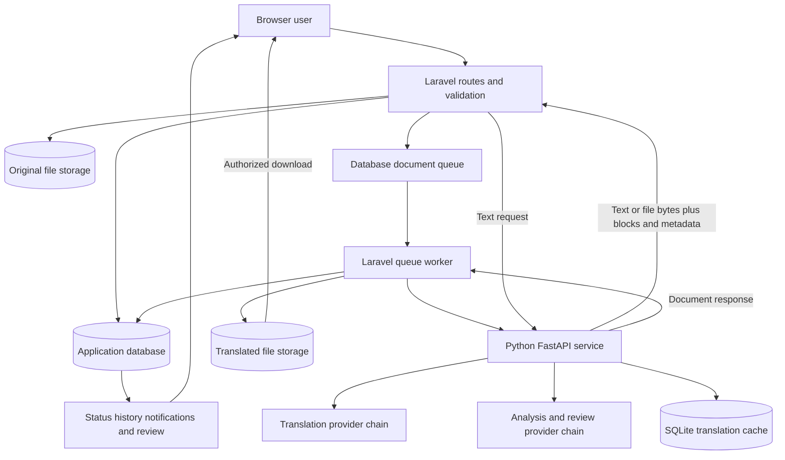
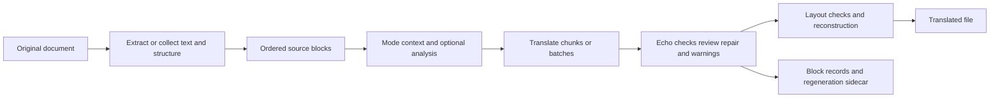

# TriLingua Current Standing and Translation Evaluation

**Assessment date:** 1 October 2026, Asia/Manila.  
**Scope:** Current local working tree, local Python health response, fresh isolated automated checks, and saved iteration 1–3 evaluation artifacts.  
**Conclusion:** TriLingua is an implemented translation and review system with substantial local test coverage. Its current evidence supports a working development system, but does not establish production readiness, human translation accuracy, or complete formatting preservation across every supported file type.

This report explains what the system currently does, how text and document translations are produced, how data moves through the application, and what the evaluations demonstrate. “Implemented” means the route or code path exists; “tested” states the particular evidence available. Historical results are not presented as measurements of today's running service.

## 1. Current system identity

TriLingua translates between English, Filipino, and Cebuano. The application contract permits six directions: English ↔ Filipino, English ↔ Cebuano, and Filipino ↔ Cebuano. This is the supported interface, not proof that all six directions have equivalent quality.

The web application uses Laravel, Blade templates, JavaScript, and Vite-built styling/assets. Laravel handles accounts, access control, input validation, document jobs, storage, history, notifications, and admin review. A separate Python FastAPI service handles extraction, translation, analysis, validation, and document reconstruction. Translation providers supply the language output; the surrounding pipeline handles document engineering.

The checked local `.env` selects PostgreSQL and a database queue. These settings establish configured intent, not that the database, worker, migrations, and queue have all been accepted in a live integration test. SQLite is used by the isolated Laravel tests in this assessment.

The root README still describes an NLLB-powered system and lists fewer formats than the current contract. It is historical documentation and should not govern current capability or provider claims. [S1, S2, S3]

## 2. Provider configuration observed now

The local Python `/health` endpoint responded successfully during this assessment and reported:

| Responsibility | Current reported route |
| --- | --- |
| Primary translation | GPT-OSS, `gpt-oss:20b-cloud` |
| Translation fallback | Gemini, `gemini-3.5-flash-lite` |
| Primary analysis and quality review | Gemini analysis, `gemini-3.5-flash-lite` |
| Analysis fallback | Ollama analysis using `gpt-oss:20b-cloud` |
| Implemented translation adapters | GPT-OSS, Gemini, NLLB |

GPT-OSS communicates through an Ollama-compatible chat endpoint. An Ollama endpoint on the PC does not by itself mean model inference happens on that PC; the reported model is a cloud model. NLLB is an available local-model adapter used in the historical evaluations, not today's reported primary translator.

Translation and analysis are separate provider chains. A GPT-OSS primary translation can therefore involve Gemini for analysis/review, and Gemini can also supply translated output if translation fallback is invoked. Describe a run using its actual provider evidence, not only the selected primary provider.

The local file sets `TRANSLATION_MAX_CONCURRENT=1` and `GPTOSS_TRANSLATION_SLOTS=1`. The experimental unit-pipeline flag is absent from the checked file and defaults to false in code. This establishes the file/default configuration; `/health` does not expose that flag, and startup environment overrides could differ. The health response verifies service responsiveness and its reported provider state; no new translation request was submitted. [S2, S4]

## 3. Current user and administrator capabilities

The system has two roles: regular user and admin. Document/text review is an admin responsibility; no separate reviewer role is established by the current route structure.

| Area | Implemented capabilities | Verification boundary |
| --- | --- | --- |
| Accounts | Registration, password login, Google sign-in routes, logout, password reset, profile and settings | Local automated coverage; actual OAuth and reset delivery not checked here |
| Text translation | Language selection, mode selection, returned translation, quality review when enabled, saved history | Code and local tests; no new live provider translation |
| Document translation | Upload validation, asynchronous jobs, status polling, translated file download, stored originals | Code and local tests; real queue/storage/provider combination not exercised here |
| Document management | Paginated document listing, preview/file routes, original downloads, rename, bookmark, deletion, re-translation | Implemented owner-scoped paths; complete served-browser walkthrough not repeated |
| History and dashboard | Translation history/details, database aggregate totals, recent activity | Fresh Laravel tests support local behavior |
| Notifications and priority | Completion/failure/review notifications, read state, priority request flag | Implemented; priority does not by itself establish faster model execution |
| Admin operations | Dashboard, review queue, text editing/verification/flagging, block editing, document regeneration, failed-job retry, user records, audit and CSV exports | Local tests; live multi-admin publication and real file fidelity remain acceptance work |

### Supported document inputs and outputs

| Input | Output | Processing behavior |
| --- | --- | --- |
| DOCX | DOCX | Collect text, translate, replay into the original document structure |
| PDF | PDF | Extract text/geometry, translate blocks, reconstruct against original pages |
| TXT | TXT | Extract and reconstruct text blocks |
| MD | MD | Extract typed text blocks and reconstruct text output; complete Markdown syntax fidelity is not established |
| CSV | CSV | Translate cells and rebuild rows through a separate cell path |
| RTF | DOCX | Extract text and convert output to DOCX |
| ODT | DOCX | Extract text and convert output to DOCX |
| PPTX | PPTX | Translate text paragraphs/table cells in the existing presentation structure |
| XLSX | XLSX | Translate string cells in the workbook; formula preservation currently fails |

These are accepted formats, not a claim of lossless conversion. RTF and ODT deliberately change output format. Images retained within documents are not generally translated as image content. The formats × six language directions × processing modes matrix has not been fully validated.

The application defaults are 8,000 text characters per request, 51,200 KB per uploaded file (50 MiB), and document intake limits of 25 files and 262,144,000 bytes (250 MiB) per user per day. Environment overrides can change these limits; the checked file does not supply overrides for these values. Limits do not establish measured performance at their maximum. [S1, S3, S5]

## 4. What block translation means

A **block** is a piece of document text attached to its original structural identity. Depending on format, it can represent a paragraph, heading, footer, text-box paragraph, PDF text region, presentation table-cell paragraph, or spreadsheet cell. A block is not necessarily a sentence or a page. A PDF extractor may split what looks like one paragraph into several regions, or group multiple lines into one region.

For example, a document containing a heading, two paragraphs, and three table cells could produce six translation blocks. TriLingua translates their text and maps each result back to its originating position. Actual extraction counts depend on the document and format reader.

Block metadata can include type, index/order, source text, font/style information, page number, and bounding box. The metadata available differs by format. Keeping it alongside the text lets reconstruction place translations into the appropriate source structure, and lets an admin edit one identified block later.

Three terms must be distinguished:

- **Block:** the source/output structural item that should retain its identity.
- **Chunk:** a subdivision or semantic grouping used to manage context and provider request size.
- **Batch:** multiple translation items packaged into one provider request or scheduling task.

A long block can require multiple chunks; multiple blocks can share a batch. In the experimental unit pipeline, semantic grouping supplies context and batch boundaries without merging separate output blocks. One output block per source block is an engineering invariant, not proof that every word or meaning survived. [S5, S6, S7]

### The experimental translation unit

`TranslationUnit` adds a typed internal record containing unit ID, source block ID, reading order, page/geometry, structural role, section, nearby source context, table headers, protected spans, and a reference to source style. Providers return results indexed by unit ID, allowing completion order to differ from document order while reconstruction still follows the original order.

This path is implemented behind `TRANSLATION_UNIT_PIPELINE`. It is currently default-off. It applies to the extract → translate → reconstruct branch; DOCX/PPTX/XLSX in-place processing and CSV retain their separate legacy paths even when the flag is enabled. Iteration 3 therefore does not validate a universal replacement pipeline for every format. [S6, S7]

## 5. How text translation happens

1. The authenticated browser submits text, source/target language, and mode to Laravel.
2. Laravel validates the request and calls Python through `TranslationManager`, presenting the configured service token.
3. Python validates the language pair and mode, obtains bounded execution capacity, and invokes `TranslationPipeline`.
4. The pipeline translates through its configured provider chain. Cache and echo checks may affect the path. An echo check tries to distinguish untranslated body text from values or names that legitimately remain unchanged.
5. Balanced/thorough processing enables AI review. If issues require repair, Python can request another translation and review it. Review failure can return valid translated text with an unavailable review and no score.
6. Python returns translated text and available provider/model, timing, token, warning, and review information.
7. Laravel attempts to persist history and supporting records, then returns the result to the browser. A history-write failure is explicitly represented as `saved:false`; receiving translated text is not proof it was saved.

Text `auto` resolves to balanced. Text mode does not run the entire document extraction/layout workflow. [S2, S8]

## 6. How document translation happens

### Intake and background execution

Laravel validates extension/content, language pair, mode, file size, and intake quota. It maintains durable original-file references and identifies matching work to reuse or avoid duplicate active jobs. A durable job record carries identifiers, source/target settings, storage pointers, progress, attempts, and recovery information.

The browser receives a job identifier and polls for state. A Laravel queue worker invokes Python using the uploaded original. A worker restart/retry can recover input from durable original storage instead of relying entirely on a temporary local file.

### Extraction and context

For PDF and other reconstructed formats, Python reads text blocks and available structure. PDF extraction supports `auto`, `single`, `left`, and `right` column modes. If an entire PDF produces no text blocks, an OCR fallback is attempted. This is a dependency-dependent fallback, not guaranteed scanned-document support.

Balanced/thorough modes can analyze document type, style/context, and terminology. A prepass uses a limited source sample to supply a summary/domain/terms; it is not a full-document comprehension guarantee. The current analyzer setting is merged, combining analyzer/prepass work where applicable. Document memory and semantic groups provide context and terminology hints.

### Translation and checking

The active legacy path performs block/chunk translation, batching where supported, context injection, optional review/repair, glossary processing, and cache use. The experimental unit path additionally maps structured units, enriches per-unit context, schedules GPT-OSS batches fairly, restores recognizable protected spans, predicts layout stress, and reassembles results by source identity.

Cache defaults enable an in-memory document layer and persistent SQLite translation cache with a 30-day TTL. Namespace/source/provider information helps separate incompatible entries. Cache contents and access/retention must be considered separately from ordinary application history. Effective cache use is configuration/path dependent; the benchmark deliberately disabled it.

Echo checks, retries, and failure handling reduce false successes, but are heuristic. Systemic provider outages are intended to abort experimental batches. Isolated failures in that path can retain source text with warnings. Therefore, a completed output can still need review for untranslated passages.

### Reconstruction and return

PDF output replaces/reinserts translated text against original page geometry, with font/fit handling. Longer target text can stress its original box. Layout preflight is advisory; it is not a rendered-image inspection.

DOCX/PPTX/XLSX use collection followed by translation and replay through the same format walker. DOCX/PPTX preserve run formatting using proportional character distribution. That preserves formatting containers but does not prove that the same semantic word remains bold or colored after word order changes.

Python returns a JSON envelope containing base64 output bytes, per-block review data, a regeneration sidecar, filename/MIME information, and metrics. Laravel decodes the file, stores the translated object, persists history and required block data, then marks the durable job completed. Metrics failure is non-fatal; required history/block failure prevents an honest completion claim. Downloads use storage availability checks. [S2, S5–S9]

## 7. System data flow

The database stores application state and audit evidence; object storage holds files. Python temporary directories hold transient working copies. Supabase is the primary file storage backend. Optional local fallback storage exists but is disabled by default; the code does not establish infrastructure encryption, shared availability, backups, or durability merely by calling a disk “persistent.” Those are deployment requirements.

Document upload/output and downloads currently read whole file contents. Python-to-Laravel base64 expands raw bytes by roughly one-third before JSON and other copies are considered. This creates a plausible memory/concurrency ceiling, but this assessment did not measure peak memory under concurrent maximum-size uploads. [S8, S9, S10]

## 8. Translation data flow

For the experimental branch, source blocks become typed units before translation and return to block-shaped data before reconstruction. Protected spans include URLs, emails, numbers, placeholders, and inline code. Restoration is conservative: it repairs tokens whose recognizable identity survives, and does not reliably restore a token that disappears entirely. This explains why protected-span support must not be described as guaranteed numeric fidelity.

## 9. Admin review and publication data flow

Each persisted document block keeps source text, immutable initial AI text, editable current draft text, published text, review status, and available quality information. Draft editing and file publication are separate operations.

Regeneration uses reconstruction rather than another AI translation. Revision/pointer checks prevent publishing a stale draft over a newer one. The prior file remains published if candidate storage/read-back fails. Verification refuses documents with unpublished edits. These controls make review state meaningful; they do not establish the reviewer’s linguistic expertise or calibrate AI scores. [S11]

## 10. Processing modes

| Mode | Intended enabled behavior | Practical qualification |
| --- | --- | --- |
| Fast | Minimal additional AI analysis/review | Still translates and reconstructs; not inherently accurate or lossless |
| Balanced | Document analysis/memory, semantic context, specialized prompts, review, cache/prepass features | Additional calls can substantially increase runtime |
| Thorough | Balanced features plus AI layout planning for PDFs | More processing is not proof of better meaning or appearance |
| Auto | File/size/structure heuristics choose a document mode | Small text can use fast; PDFs and complex documents can use thorough; text endpoint uses balanced |

Flags, configured providers, and format-specific branches affect actual execution. For example, CSV follows a separate cell implementation, and in-place Office formats do not enter the experimental unit route. The preset table is therefore a configuration description, not proof that every feature executes for every format. [S5, S12]

## 11. Iteration 1–3 story-book summary

The later **Part2 story-book evaluation** is the main three-iteration comparison. It uses two supplied 25-page parallel editions, English and Cebuano, translating in both directions. Metrics use all extracted PDF pages with whitespace normalization. Scores compare output with those specific reference editions.

| Iteration | Direction | BLEU | chrF | Elapsed | Evidence type |
| --- | --- | ---: | ---: | --- | --- |
| 1 NLLB | English → Cebuano | 26.67 | 58.44 | 3.27 min | Measured full-document run, fast mode |
| 1 NLLB | Cebuano → English | 31.03 | 57.00 | 2.45 min | Measured full-document run, fast mode |
| 2 supplied GPT-OSS output | English → Cebuano | 29.68 | 61.86 | Not supplied | Scored existing PDF |
| 2 supplied GPT-OSS output | Cebuano → English | 52.52 | 74.33 | Not supplied | Scored existing PDF |
| 3 GPT-OSS unit pipeline | English → Cebuano | 28.27 | 60.77 | 13.86 min | Median of three live runs, balanced mode |
| 3 GPT-OSS unit pipeline | Cebuano → English | 44.55 | 70.71 | 13.98 min | Median of three live runs, balanced mode |

### Iteration 1

The local CPU model was `facebook/nllb-200-distilled-600M` at the recorded revision. Fast mode, fallback disabled, and translation cache disabled were used. Both full-document directions completed with passing page-count/non-empty-text structural checks. Separate excerpt repetitions succeeded three times per direction with one distinct output hash; median excerpt times were 0.25 min English → Cebuano and 0.17 min Cebuano → English. Excerpt stability does not establish full-document stability under every input. [S13]

### Iteration 2

Two supplied GPT-OSS PDFs were evaluated. Each had 25 pages and non-empty extracted text. Their reference-overlap scores exceeded the corresponding NLLB story-book results, particularly Cebuano → English. However, translation runtime, precise model/configuration, cache/fallback settings, and production lineage were not supplied. They are useful output-quality comparison artifacts, but not a controlled runtime benchmark. [S14]

### Iteration 3

The provider-neutral unit pipeline was tested through six live GPT-OSS translation runs: three in each direction, balanced mode, translation fallback disabled, translation cache disabled, and unit pipeline enabled by the harness. “GPT-OSS only” describes the translation route: saved health metadata still reports Gemini analysis with Ollama analysis fallback. It must not be interpreted as proof that every AI call used GPT-OSS. [S15, S16]

| Direction/run | Time seconds | BLEU | chrF | Blocks translated | Echo retries | Recorded LLM calls |
| --- | ---: | ---: | ---: | ---: | ---: | ---: |
| English → Cebuano 1 | 772.8 | 29.38 | 60.77 | 49 | 1 | 57 |
| English → Cebuano 2 | 831.8 | 27.84 | 60.91 | 49 | 0 | 59 |
| English → Cebuano 3 | 990.4 | 28.27 | 60.02 | 49 | 1 | 59 |
| Cebuano → English 1 | 620.5 | 44.76 | 70.80 | 48 | 6 | 71 |
| Cebuano → English 2 | 838.7 | 44.55 | 70.71 | 48 | 6 | 69 |
| Cebuano → English 3 | 870.3 | 43.83 | 70.19 | 48 | 6 | 70 |

All six outputs retained 25 pages, extractable text, and 49 block records. English → Cebuano translated all 49 blocks; Cebuano → English translated 48 with one short block preserved by the passthrough filter. Recorded provider retries/failures were zero, but echo retries and quality retranslations occurred. These are different categories and should not be collapsed into “no retries.”

The recorded result is **conditional pass**. A citation numeral `22` disappeared on all three Cebuano → English outputs. One short source block was intentionally passed through. Output hashes differed between repeats, so structure was stable while exact output was not.

Iteration 3 median overlap scores were below the supplied iteration 2 artifacts: English → Cebuano by 1.41 BLEU/1.09 chrF points, and Cebuano → English by 7.97 BLEU/3.62 chrF points. Missing matched iteration 2 runtime/configuration means these differences cannot isolate the pipeline as the cause. Iteration 1 fast-mode runtimes also cannot isolate provider speed from iteration 3 balanced-mode overhead.

The run metrics show three scheduler batches with one slot. They also record 57–71 LLM calls per document, including review/repair activity. Scheduler waiting and remote generation contribute to latency. Provider time, LLM totals, and scheduler waits can overlap or aggregate different work; do not add them as mutually exclusive wall-clock phases.

**Evidence corrections:** the acceptance report's `layout_validation=pass` is based on matching page count and non-empty text in the benchmark function, not a complete rendered-layout measurement. Page samples exist, but this assessment did not perform an all-page visual review. The top-level metadata records `<unset>` flags and a default slot value of 8 because the harness reads its parent environment, while child-process settings/per-run metrics show enabled unit processing and one actual slot. Future benchmarks should capture effective child configuration directly. Numeric checking searches multi-digit tokens, and zero missing placeholders with zero placeholders present is not placeholder coverage. [S15, S16]

## 12. Earlier SONA and brochure evaluation

This is a separate cohort and must not be merged into the story-book table. It evaluated English → Filipino and English → Cebuano with fast mode, disabled fallback/cache, the SONA 2019 English PDF and reference editions, plus a PSF brochure without a verified reference translation.

| Provider/input/direction | Result | BLEU | chrF | Time |
| --- | --- | ---: | ---: | ---: |
| NLLB SONA → Filipino | Completed, structural pass | 29.42 | 69.47 | 25.49 min |
| NLLB SONA → Cebuano | Completed, structural pass | 19.08 | 65.06 | 29.39 min |
| GPT-OSS SONA → Filipino | Failed after two unchanged blocks | — | — | 89.84 min |
| GPT-OSS SONA → Cebuano | Not run after user stop | — | — | — |
| NLLB brochure → Filipino | Completed, structural pass | — | — | 4.69 min |
| NLLB brochure → Cebuano | Failed after three unchanged blocks | — | — | 4.92 min |
| GPT-OSS brochure → Filipino | Failed after one unchanged block | — | — | 11.47 min |
| GPT-OSS brochure → Cebuano | Completed, structural pass | — | — | 21.76 min |

NLLB's two-page SONA excerpt completed three repetitions per target with one distinct output hash. Median times were 1.61 min for Filipino and 1.52 min for Cebuano. GPT-OSS stability runs were not performed after the user stopped the evaluation. The failed translations were rejected instead of returning the source PDF as a false success.

The original SONA-based provider-promotion gate was not met. Later story-book results provide different evidence; they do not retroactively complete missing SONA runs or prove Filipino/Cebuano production parity. [S17]

## 13. What quality scores mean

BLEU and chrF are reference-overlap metrics. They help compare outputs using the same reference, normalization, and evaluation scope. They are not percentages of sentences translated correctly. A valid alternate translation can score lower; an output with a harmful omission can still obtain a substantial score.

AI review scores are model-generated assessments, not calibrated confidence probabilities or bilingual human judgments. An unavailable review should remain unscored. Block/page survival and file openability address engineering properties; they do not demonstrate semantic completeness. None of the saved iteration reports establishes human-validated accuracy across all languages, domains, or formats. [S13–S17]

## 14. Current limitations and their consequences

| Limitation | Evidence and consequence | Needed correction or validation |
| --- | --- | --- |
| XLSX formulas are lost | Fresh temporary-workbook check through the actual reconstruction walker changed `=SUM(1,2)` to an empty cell; the writer loads with `data_only=True` | Preserve formulas in the shared writer and verify formula/text/style round-trip before claiming spreadsheet fidelity |
| Numeric preservation is incomplete | Iteration 3 lost citation numeral `22` in every Cebuano → English run; restoration cannot reliably recover absent tokens | Validate exact numeric inventories and repair or reject omissions |
| Partial untranslated output can survive | Passthrough heuristics and isolated unit failure retention exist | Surface warnings and distinguish legitimate unchanged identifiers from untranslated content |
| Formatting is approximate | PDF fit predictions are advisory; DOCX/PPTX run text is redistributed proportionally | Inspect rendered pages/slides for clipping, spacing, and semantic emphasis |
| OCR coverage is narrow | Fallback triggers when no PDF text blocks exist, requires Tesseract/dependencies, defaults to English OCR | Validate language settings and mixed scanned/text pages; image text in normal Office files is not general OCR coverage |
| Context is limited | Prepass samples source; batching/chunking limits context | Human review of cross-block meaning, pronouns, terminology, and long-document continuity |
| Throughput is unproven | Current file configuration serializes requests/slots; six historical story-book runs took roughly 10–16.5 min | Measure representative workloads, queue wait, actual provider limits, and memory before changing concurrency |
| Storage/deployment assurance remains open | Code has retries/fallback/recovery, but infrastructure durability and real backend behavior were not tested here | Real storage outage/retry/read-back/cleanup tests and backup/restore evidence |
| Logging/privacy needs verification | Python code prints source excerpts/context; default Laravel stack uses an unrotated single log unless overridden | Audit content exposure and configure access/retention for logs, cache, database, sidecars, and files |
| Full capability matrix is untested | Saved trials emphasize PDFs and selected directions | Real format × direction cases and bilingual meaning/layout assessment |

Document preview, pagination, and downloads do not establish full-browser usability/accessibility. The Documents list is now paginated, but page-local filtering should not be represented as a global search unless server-side filter behavior is verified.

No code fix was made as part of this report. The XLSX reproduction used disposable files and a deterministic translation callback, with no provider call or original-file modification. [S5–S7, S10, S18]

## 15. Current verification and release standing

### Fresh checks on 1 October 2026

| Check | Result |
| --- | --- |
| Pre-boot Laravel test-environment guard | Passed; SQLite `:memory:`, testing environment, no cached config |
| `php artisan test --compact` | 474 passed, 1,800 assertions, 24.39 seconds |
| Deterministic Python suite | 372 passed, 35 deselected, 51.63 seconds |
| Local Python `/health` | Successful response reporting GPT-OSS/Gemini translation and Gemini/Ollama analysis chains |
| Disposable XLSX formula round-trip | Formula-loss defect reproduced |

Python command: `python -m pytest Model/tests -m "not slow and not golden and not font_regression" --ignore=Model/tests/test_concurrency_benchmark.py --ignore=Model/tests/test_reference_gemini_workflow.py -q`.

Excluded tests and mocked/provider-independent checks do not establish live model quality. Laravel emitted doc-comment metadata deprecation warnings; these did not fail its suite. The new counts supersede older local counts of 407 Laravel/352 Python tests for this snapshot. Historical asset-build/browser checks remain historical; they were not rerun here.

The September 29 audit's cleanup-reference, service-token mismatch, capped dashboard totals/document list, and inconsistent completed-download findings are addressed in current source: cleanup includes live/recoverable jobs, Python uses the canonical Laravel token and refuses tokenless production startup, totals use database aggregates, Documents uses pagination, and completed reuse uses a shared download resolver. Do not list those earlier defects as still open without a fresh reproduction. [S18, S19]

**Release standing:** local engineering checks are strong, but production acceptance remains incomplete. Outstanding evidence includes real PostgreSQL with multiple queue workers, worker crash/retry/reconciliation, real storage operations, representative live translations through Laravel, document openability/rendered fidelity, complete user/admin/mobile/keyboard workflows, and human translation judgments against agreed criteria. The newly reproduced XLSX data-loss defect is also a concrete unresolved issue.

## 16. Recommended next work

1. Fix and verify the shared XLSX formula-preservation defect before using formula-bearing workbooks.
2. Reproduce the citation-number omission with current code, then require protected-token completeness or an explicit failed/warning outcome.
3. Run a matched legacy-versus-unit comparison using identical inputs, provider/model routes, mode, cache/fallback settings, and effective child-process configuration. Keep the experimental flag default-off until the promotion decision is evidence-backed.
4. Obtain bilingual human meaning review and inspect complete rendered outputs. Include Filipino and both Filipino/Cebuano directions, not only English/Cebuano story-book PDFs.
5. Complete real queue/database/storage acceptance and measure large-document memory/latency. Then issue a release verdict for that deployed configuration.

These are recommendations, not changes implemented by this assessment.

## Evidence index

Paths below are relative to `C:\dev\Trilingua` and identify the inspected sources.

- **S1:** `trilingua-code/config/translation.php` — languages, limits, modes, formats, output mappings.
- **S2:** `trilingua-code/Model/server.py` and local `GET http://127.0.0.1:5000/health` — provider chains, service token, text/document endpoints and response contract.
- **S3:** `trilingua-code/routes/web.php`; `README.md` — role/user/admin routes and stale README claims.
- **S4:** Allowlisted non-secret values from `trilingua-code/.env`; `Model/providers/gptoss.py`; `Model/config/environment.py` — configuration and provider loading. Secrets were not included in this report.
- **S5:** `trilingua-code/Model/pipeline/document_pipeline.py`; `Model/document/extractor.py`; `Model/document/reconstructor.py`; `Model/document/ocr_extractor.py` — format paths, context, reconstruction and OCR.
- **S6:** `trilingua-code/Model/pipeline/translation_pipeline.py` — legacy/unit processing, caching, echo/failure behavior and experimental flag.
- **S7:** `trilingua-code/Model/dto/pipeline.py`; `Model/document/protected_spans.py`; `Model/document/layout_preflight.py` — unit structure and preservation limits.
- **S8:** `trilingua-code/app/Http/Controllers/TranslationController.php`; `app/Services/Translation/TranslationManager.php` — application requests, persistence outcomes and Python transport.
- **S9:** `trilingua-code/app/Jobs/TranslateDocumentJob.php`; `app/Models/TranslationJob.php`; `app/Services/BlockService.php` — durable state, completion requirements and block persistence.
- **S10:** `trilingua-code/app/Services/StorageService.php`; `config/storage.php`; `Model/cache/sqlite_cache.py`; `config/logging.php` — storage, cache and log defaults.
- **S11:** `trilingua-code/app/Services/Admin/ReviewService.php` — drafts, regeneration, revision/pointer checks and publication.
- **S12:** `trilingua-code/Model/config/processing_modes.py` — processing presets.
- **S13:** `chatgpt/Part2 test/Part2 Iteration 1 NLLB Evaluation.md`; `iteration-1-nllb-200-600m/run-metadata.json` — story-book iteration 1.
- **S14:** `chatgpt/Part2 test/iteration-2-gptoss-artifacts.json`; `Part2 Iteration Comparison and Current State Logging Audit.md` — scored supplied iteration 2 PDFs.
- **S15:** `chatgpt/Part2 test/phase-6-unit-pipeline-gptoss/ACCEPTANCE.md`; `findings.json`; `run-metadata.json` — six-run iteration 3 results.
- **S16:** `trilingua-code/Model/benchmarks/phase6_unit_pipeline_gptoss.py` — benchmark configuration, scoring, structural test and metadata capture.
- **S17:** `chatgpt/test/comparison/Trilingua-Iteration-1-and-2-Findings.md` — distinct SONA/brochure cohort and stop condition.
- **S18:** Current `app/Services/StorageCleanupService.php`, `app/Http/Controllers/DashboardController.php`, `DocumentsController.php`, `app/Services/HistoryService.php`, `app/Services/Translation/CompletedDownloadResolver.php`; fresh Laravel/Python outputs and XLSX reproduction — current corrections and checks.
- **S19:** `docs/CURRENT_SYSTEM_REEVALUATION_2026-09-29.md`; `trilingua-code/docs/implementation-records/post-audit-release-report.md` — historical standing, used with current-source verification.

**Result:** Current capabilities, both data flows, block/unit mechanics, limitations, and separate iteration cohorts documented.  
**Checked:** Current source/configuration, local health, 474 Laravel tests, 372 deterministic Python tests, saved benchmark records, and XLSX formula behavior.  
**Remaining:** Formula loss, protected-number fidelity, matched unit-pipeline comparison, live integration/format coverage, and human translation/layout acceptance.
